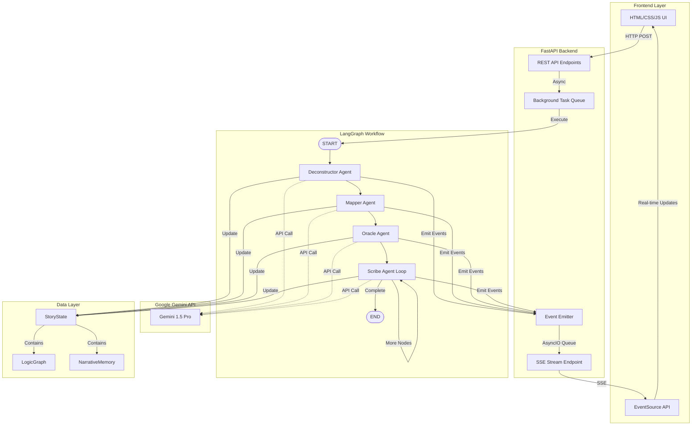
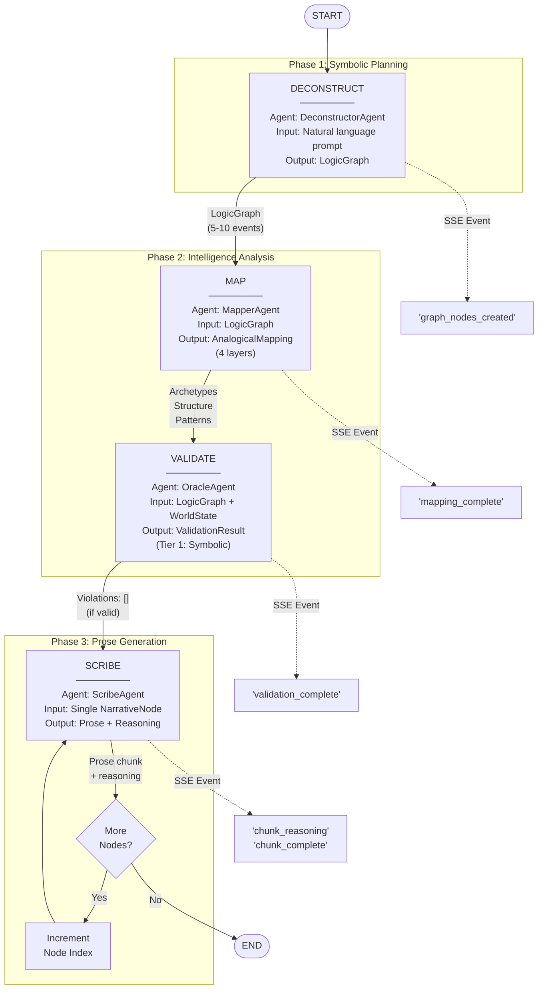
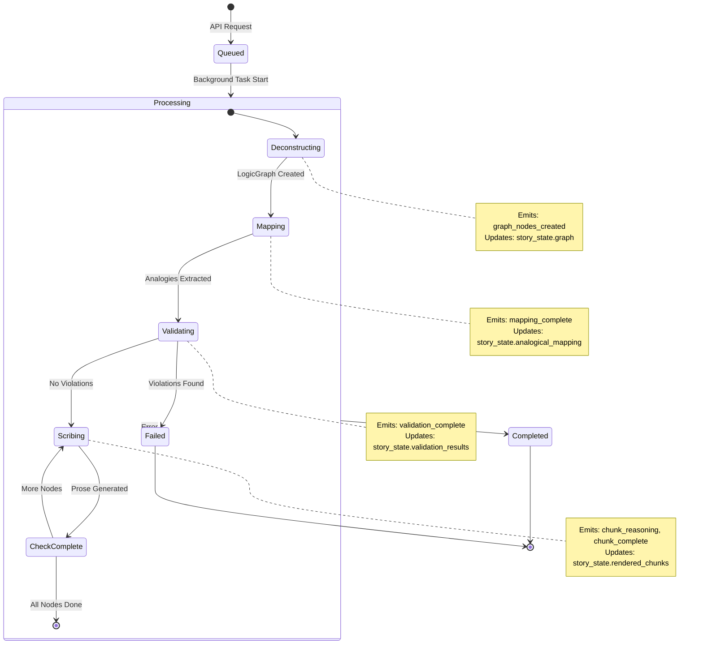
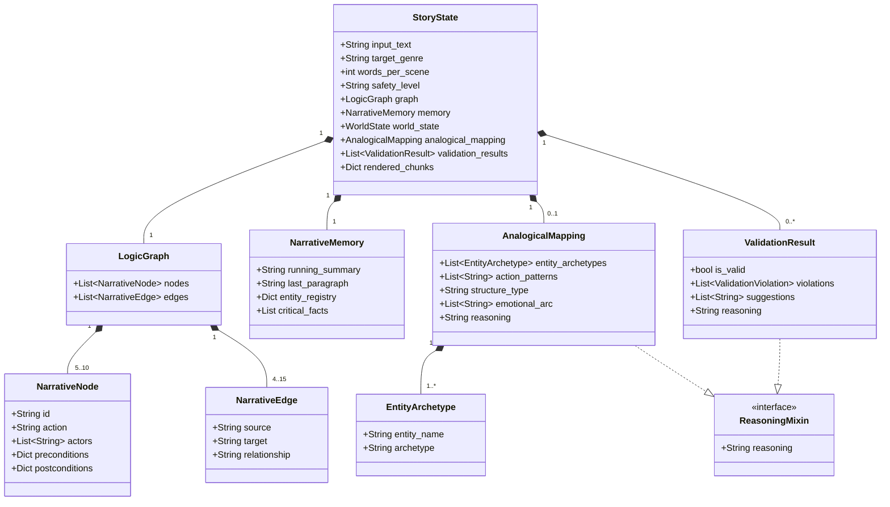

# Plotline

> **A neuro-symbolic narrative engine combining symbolic reasoning with neural language generation for coherent story construction.**

[](https://python.org) [](https://fastapi.tiangolo.com) [](LICENSE)

---

## Abstract

This project implements a neuro-symbolic approach to automated narrative generation, addressing fundamental limitations of pure neural language models: plot inconsistency, logical contradictions, and lack of structural coherence. By separating symbolic planning from neural prose generation, the system achieves reliable story construction while maintaining creative language quality.

**Current Status**: Minimum Viable Product (MVP) complete, implementing approximately 60% of the original research vision.

**Key Innovation**: Real-time reasoning visualization via Server-Sent Events, enabling transparent observation of multi-agent narrative construction workflows.

---

## Table of Contents

- [Motivation](#motivation)
- [System Architecture](#system-architecture)
- [Research Foundations](#research-foundations)
- [Implementation Details](#implementation-details)
- [Getting Started](#getting-started)
- [Project Structure](#project-structure)
- [Current Capabilities](#current-capabilities)
- [Known Limitations](#known-limitations)
- [Roadmap](#roadmap)
- [Contributing](#contributing)
- [References](#references)

---

## Motivation

### The Problem

Contemporary large language models (LLMs) demonstrate impressive fluency in natural language generation but exhibit systematic failures in narrative coherence:

1. **Plot Inconsistency**: Characters forget prior actions or exhibit contradictory behaviors
2. **Logical Violations**: Events occur without causal justification or violate physical constraints
3. **Structural Incoherence**: Narratives lack clear dramatic arcs or thematic unity
4. **Opacity**: Generation process occurs in a "black box" without interpretable reasoning

### Our Approach

We implement a hybrid neuro-symbolic architecture that:

- **Separates Planning from Execution**: Symbolic logic graphs define plot structure before neural prose generation
- **Validates Before Writing**: Multi-tier validation catches contradictions prior to text synthesis
- **Exposes Reasoning**: All agents emit explicit reasoning traces for transparency
- **Enables User Control**: Configurable parameters for word count, safety, and stylistic preferences

### Research Basis

This architecture builds on established research in:
- Neuro-symbolic AI (Kautz et al., 2023)
- Narrative intelligence and plot graphs (Ammanabrolu et al., 2019)
- Commonsense reasoning (Sap et al., 2019)
- Chain-of-thought prompting (Wei et al., 2022)

---

## System Architecture

### High-Level Pipeline

```
Input Prompt → Symbolic Planning → Validation → Neural Generation → Output
     ↓              ↓                   ↓              ↓               ↓
  "Robot      LogicGraph (5       Constraint       Prose with    Coherent
   story"      events)            Checking         Reasoning     Narrative
```

### System Architecture Diagram



### LangGraph Workflow

The system implements a directed graph workflow using the LangGraph framework:



**Implementation**: [`backend/graph/workflow.py`](backend/graph/workflow.py)

### State Flow Diagram



### Core Components

#### 1. Symbolic Representation Layer

**LogicGraph**: Directed graph of narrative events
```python
class LogicGraph(BaseModel):
    nodes: List[NarrativeNode]  # Events with preconditions/postconditions
    edges: List[NarrativeEdge]  # Causal relationships
```

**Purpose**: Ensures plot coherence through explicit state tracking and causal validation.

**Research Foundation**: "Story Generation with Crowdsourced Plot Graphs" (Ammanabrolu et al., AAAI 2019)

#### 2. Analogical Mapping Layer

**AnalogicalMapping**: Four-layer narrative decomposition
```python
class AnalogicalMapping(BaseModel):
    entity_archetypes: List[EntityArchetype]  # Character roles
    action_patterns: List[str]                # Plot patterns
    structure_type: str                       # Narrative framework
    emotional_arc: List[str]                  # Emotional progression
```

**Purpose**: Identify universal narrative patterns to guide generation.

**Research Foundation**: "Surfaces and Essences" (Hofstadter, 2013); "The Hero with a Thousand Faces" (Campbell, 1949)

### Data Model Relationships



**Purpose**: Ensures plot coherence through explicit state tracking and causal validation.

#### 3. Validation Layer

**OracleAgent**: Multi-tier consistency checking

- **Tier 1 (Symbolic)**: Precondition satisfaction, temporal consistency
- **Tier 2 (Commonsense)**: LLM-based plausibility checks
- **Tier 3 (NLI)**: Contradiction detection (planned)

**Research Foundation**: "ATOMIC: An Atlas of Machine Commonsense" (Sap et al., AAAI 2019)

#### 4. Neural Generation Layer

**ScribeAgent**: Prose synthesis with reasoning

```python
class ScribeOutput(BaseModel, ReasoningMixin):
    reasoning: str  # Explicit thought process
    prose: str      # Generated narrative text
```

**Purpose**: Generate fluent prose while maintaining transparency through reasoning traces.

**Research Foundation**: "Chain-of-Thought Prompting" (Wei et al., NeurIPS 2022); "ReAct" (Yao et al., ICLR 2023)

---

## Implementation Details

### Technology Stack

**Backend**:
- FastAPI 0.100+ (async web framework)
- LangGraph 0.1+ (state machine workflows)
- Pydantic 2.0+ (data validation)
- google-genai 0.2+ (LLM API client)

**Frontend**:
- Vanilla JavaScript (no framework dependencies)
- Server-Sent Events API (native browser support)
- CSS3 with glassmorphism aesthetics

**Infrastructure**:
- Python 3.10+
- Google Gemini API (15 RPM free tier)

### Key Architectural Decisions

#### 1. SDK Migration

**Context**: Mid-project, `google.generativeai` package was deprecated

**Solution**: Migrated to `google.genai` with minimal disruption

```python
# Deprecated approach
import google.generativeai as genai
model = genai.GenerativeModel('gemini-1.5-pro')
response = await model.generate_content_async(prompt)

# Current implementation
import google.genai as genai
client = genai.Client(api_key=settings.GEMINI_API_KEY)
response = await client.aio.models.generate_content(
    model=settings.GEMINI_MODEL,
    contents=prompt,
    config=types.GenerateContentConfig(
        response_schema=schema,
        response_mime_type="application/json"
    )
)
```

**Discovery Method**: Used `dir()` introspection to locate `.aio` accessor for async operations

**Documentation**: [`artifacts/walkthrough.md`](artifacts/walkthrough.md)

#### 2. State Management

**Challenge**: Pass task_id through LangGraph workflow for event emission

**Solution**:
```python
# GraphState type definition
class GraphState(TypedDict):
    story_state: StoryState
    current_node_index: int
    task_id: str  # Added for SSE streaming

# Usage in workflow nodes
async def node_scribe(state: GraphState):
    task_id = state.get("task_id")
    await event_emitter.emit(task_id, "chunk_start", {...})
```

#### 3. Type Safety

**Approach**: Pydantic schema generation for Gemini structured output

```python
# Define response structure
class ScribeOutput(BaseModel, ReasoningMixin):
    reasoning: str
    prose: str

# Generate JSON schema
schema = ScribeOutput.model_json_schema()

# Gemini enforces schema
response = await client.aio.models.generate_content(
    config=types.GenerateContentConfig(response_schema=schema)
)

# Guaranteed valid response
validated = ScribeOutput.model_validate_json(response.text)
```

**Benefit**: Zero manual JSON parsing or validation

---

## Getting Started

### Prerequisites

- Python 3.10 or higher
- [uv](https://github.com/astral-sh/uv) (fast Python package manager)
- Google Gemini API key ([obtain here](https://makersuite.google.com/app/apikey))
- 8GB RAM minimum (for local development)

### Installation

```bash
# Clone repository
git clone <repository-url>
cd plotline

# Install uv (if not already installed)
curl -LsSf https://astral.sh/uv/install.sh | sh

# Install dependencies using uv
uv sync

# Configure environment
cp .env.example .env
# Edit .env and set GEMINI_API_KEY=your_api_key_here
```

### Running the System

**Backend Server**:
```bash
uv run uvicorn backend.main:app --host 127.0.0.1 --port 8000 --reload
```

**Frontend Interface**:
```bash
# Option 1: Direct file access
open frontend/index.html

# Option 2: Local server (recommended)
python -m http.server 8080 --directory frontend
# Navigate to http://localhost:8080
```

### Basic Usage

1. Open frontend interface
2. Enter narrative prompt (e.g., "A robot discovers consciousness in a dystopian city")
3. Configure parameters:
   - Genre: Science Fiction
   - Words per scene: 200 (range: 50-1000)
   - Safety level: None (options: none/low/medium/high)
4. Click "Generate Story"
5. Observe real-time thinking panel for agent reasoning
6. View generated narrative in output panel

### API Usage

**Start Generation**:
```bash
curl -X POST http://localhost:8000/api/narrative/generate \
  -H "Content-Type: application/json" \
  -d '{
    "input_text": "A robot discovers emotions",
    "target_genre": "Science Fiction",
    "words_per_scene": 200,
    "safety_level": "none"
  }'
```

**Stream Real-Time Thinking**:
```bash
curl -N http://localhost:8000/api/narrative/stream/{task_id}
```

**Check Status**:
```bash
curl http://localhost:8000/api/narrative/status/{task_id}
```

---

## Project Structure

```
plotline/
│
├── backend/
│   ├── agents/
│   │   ├── deconstructor.py      # LogicGraph extraction
│   │   ├── mapper.py             # Analogical mapping
│   │   ├── oracle.py             # Validation tiers
│   │   └── scribe.py             # Prose generation
│   │
│   ├── graph/
│   │   └── workflow.py           # LangGraph state machine
│   │
│   ├── models/
│   │   └── schemas.py            # Pydantic models
│   │
│   ├── routes/
│   │   └── narrative.py          # FastAPI endpoints + SSE
│   │
│   ├── utils/
│   │   ├── gemini_client.py      # Gemini API wrapper
│   │   └── event_emitter.py      # SSE queue manager
│   │
│   ├── config.py                 # Settings
│   └── main.py                   # FastAPI app
│
├── frontend/
│   ├── index.html                # UI layout
│   ├── script.js                 # EventSource + API calls
│   └── style.css                 # Glassmorphism design
│
├── test_agents.py                # Agent unit tests
├── test_phase2.py                # Phase 2 integration tests
├── requirements.txt              # Dependencies
├── .env                          # API keys
└── README.md                     # This file
```

---

## Current Capabilities

### Implemented Features (v0.1.0)

| Component | Status | Description |
|-----------|--------|-------------|
| **Symbolic Deconstruction** | Complete | Extract 5-10 event nodes with causal relationships |
| **4-Layer Analogical Mapping** | Complete | Entity archetypes, action patterns, structure type, emotional arc |
| **Symbolic Validation (Tier 1)** | Complete | Precondition checking, temporal consistency |
| **Commonsense Validation (Tier 2)** | Implemented (disabled) | LLM-based plausibility checks (adds 5s latency) |
| **Prose Generation with Reasoning** | Complete | 50-1000 words per scene, explicit thought traces |
| **Real-Time Thinking Panel** | Complete | SSE-based live reasoning display |
| **User Controls** | Partial | Word count (complete), safety levels (complete), style (planned) |
| **Glass Box UI** | Complete | Accordion-based reasoning visualization |

### Validation Results

**Test Case**: "A robot discovers emotions in a dystopian city"

**Generated Output**:
- LogicGraph: 5 narrative events
- Analogical Mapping: Structure type "Initiation", Hero archetype identified
- Validation: 0 violations (Tier 1 symbolic checks)
- Prose: 856 characters across 5 scenes
- Generation Time: ~15 seconds

**Reasoning Trace Example**:
```
"I'm establishing the discovery moment with sensory details and internal conflict.
The metallic environment contrasts with the organic emotion emerging..."
```

---

## Known Limitations

### Critical Issues

1. **Missing SummarizerAgent**
   - **Impact**: Memory drift after approximately 10 scenes
   - **Cause**: `running_summary` grows unbounded without compression
   - **Effort to Fix**: 2 hours
   - **Priority**: High

2. **In-Memory Persistence**
   - **Impact**: All state lost on server restart
   - **Cause**: Using `MemorySaver` instead of `SqliteSaver`
   - **Effort to Fix**: 2 hours
   - **Priority**: High

3. **Untested Long-Context Performance**
   - **Impact**: Unknown behavior for 50+ scene narratives
   - **Cause**: No integration tests for extended stories
   - **Effort to Fix**: 4 hours
   - **Priority**: Medium

### Medium Priority Issues

4. **Oracle Tier 2 Disabled**
   - **Impact**: Only catches explicit logical errors, not semantic implausibilities
   - **Cause**: Adds 5 seconds per story (performance concern)
   - **Effort to Fix**: 0 hours (uncomment code)
   - **Priority**: Medium

5. **Hardcoded Rate Limit**
   - **Impact**: Conservative 10 RPM vs. 15 RPM free tier allowance
   - **Cause**: Static initialization in `gemini_client.py:61`
   - **Effort to Fix**: 5 minutes
   - **Priority**: Low

### Planned Features

6. **Oracle Tier 3 (NLI Contradiction Detection)**: DeBERTa-MNLI integration
7. **HITL Review Interfaces**: Manual approval for mapper/oracle results
8. **Genre Transfer Workflow**: Rewrite existing plots in different genres
9. **Time-Travel Debugging**: Visual checkpoint history navigation

**Complete Analysis**: See [`artifacts/engineering_audit.md`](artifacts/engineering_audit.md)

---

## Roadmap

### Version 0.2.0 - Production Viability (2 weeks)

**Goal**: Support coherent long-form narratives

- [ ] Implement SummarizerAgent with periodic memory compression
- [ ] Migrate to SQLite-based checkpointing for persistence
- [ ] Enable Oracle Tier 2 validation with performance profiling
- [ ] Conduct 50-node story integration tests
- [ ] Document optimal prompting strategies

### Version 0.3.0 - Advanced Validation (3 weeks)

**Goal**: Improve narrative quality through enhanced constraints

- [ ] Integrate Oracle Tier 3 (NLI) using DeBERTa-MNLI
- [ ] Implement ATOMIC-Lite commonsense rule dictionary
- [ ] Add frontend visualization for validation results
- [ ] Create validation rule configuration system
- [ ] Publish validation effectiveness benchmarks

### Version 0.4.0 - User Experience (4 weeks)

**Goal**: Expand creative control and usability

- [ ] Enhanced writing style controls (voice, tense, prose density)
- [ ] Inline scene editing with automatic revalidation
- [ ] Project save/load functionality
- [ ] Export to multiple formats (PDF, EPUB, Markdown)
- [ ] Collaborative editing support

### Version 1.0.0 - Production Hardening (6 weeks)

**Goal**: Enterprise-ready deployment

- [ ] User authentication and authorization
- [ ] API rate limiting and quota management
- [ ] Automated job cleanup (24-hour TTL)
- [ ] Comprehensive logging and monitoring
- [ ] HITL review interfaces for mapper and oracle
- [ ] Time-travel debugging UI
- [ ] Performance optimization (parallel scribe execution)

---

## Contributing

### High-Impact Contribution Areas

1. **SummarizerAgent Implementation** (Priority: Critical)
   - Design memory compression algorithm
   - Preserve critical narrative facts
   - Estimated effort: 2 hours

2. **Oracle Tier 3 (NLI)** (Priority: High)
   - Integrate DeBERTa-MNLI model
   - Implement prose contradiction detection
   - Estimated effort: 4 hours

3. **Frontend Phase 2 UI** (Priority: Medium)
   - Display analogical mapping results
   - Visualize validation violations
   - Estimated effort: 3 hours

4. **Testing Suite** (Priority: Medium)
   - Unit tests for all agents
   - Integration tests for workflow
   - Long-context performance benchmarks
   - Estimated effort: 8 hours

### Research Opportunities

- Multi-POV narrative generation
- Interactive story steering (user intervention mid-generation)
- Visual story graph generation and editing
- Genre-specific archetype libraries
- Cross-cultural narrative pattern analysis

### Contribution Guidelines

1. Fork the repository
2. Create a feature branch (`git checkout -b feature/amazing-feature`)
3. Implement changes with comprehensive tests
4. Update documentation (including this README if applicable)
5. Submit pull request with clear description linking to relevant issues

---

## References

**Core Technologies**:
- [LangGraph](https://langchain-ai.github.io/langgraph/) - State machine workflows
- [Google Gemini API](https://ai.google.dev/) - LLM with structured output
- [FastAPI](https://fastapi.tiangolo.com/) - Async web framework
- [Pydantic](https://docs.pydantic.dev/) - Data validation
- [uv](https://github.com/astral-sh/uv) - Fast Python package manager

---

## License

This project is licensed under the MIT License - see the [LICENSE](LICENSE) file for details.

---

## Acknowledgments

This work builds on research from Georgia Institute of Technology, Stanford University, Princeton University, Anthropic, MIT, and Google Research. Special thanks to the open-source community for LangGraph, FastAPI, and Pydantic frameworks.

**Contact**: For questions or collaboration inquiries, please open an issue on GitHub.

---

*Last Updated: January 2026*
*Version: 0.1.0 (MVP)*
*Status: Active Development*
